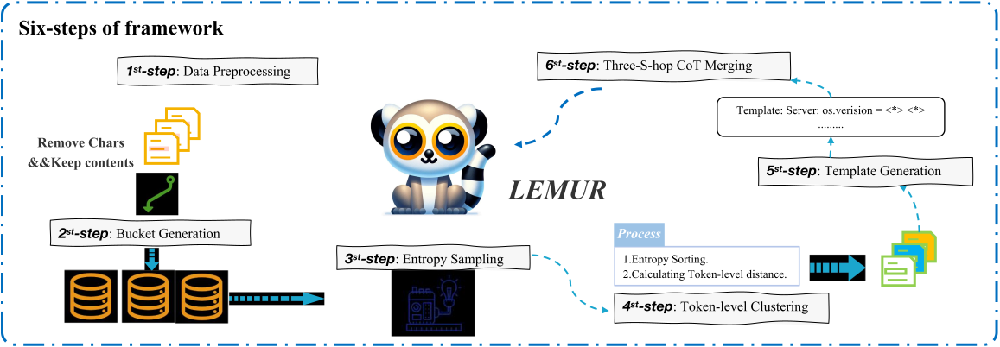
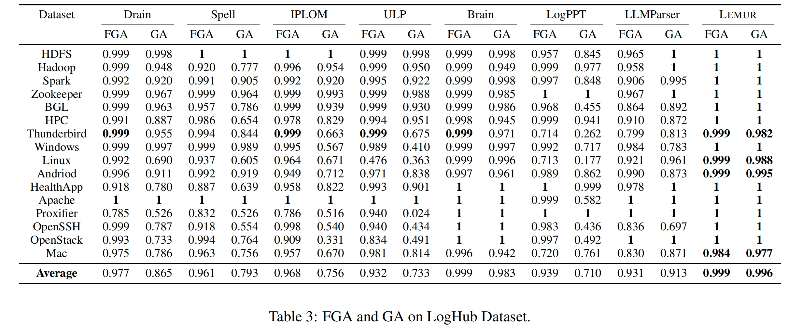
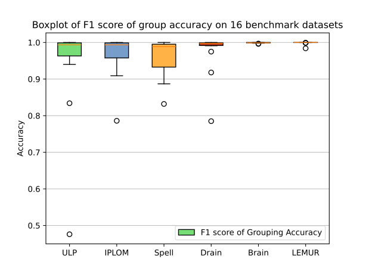
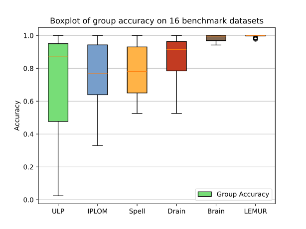

<div align= "center">
    <h1>  LEMUR</h1>
</div>

## Abstract

Logs produced by extensive software systems are integral to monitoring system behaviors. Advanced log analysis facilitates the detection, alerting, and diagnosis of system faults. Log parsing, which entails transforming raw log messages into structured templates, constitutes a critical phase in the automation of log analytics. Existing log parsers fail to identify the correct templates due to reliance on human-made rules. Besides, These methods focus on statistical features while ignoring semantic information in log messages. 
To address these challenges, we introduce a cutting-edge **L**og parsing framework with **E**ntropy sampling and Chain-of-Thought **M**erging (**LEMUR**). Specifically, to discard the tedious manual rules. We propose a novel sampling method inspired by information entropy, which efficiently clusters typical logs. Furthermore, to enhance the merging of log templates, we design a chain-of-thought method for large language models (LLMs). LLMs exhibit exceptional semantic comprehension, deftly distinguishing between parameters and invariant tokens. We have conducted experiments on large-scale public datasets. Extensive evaluation
demonstrates that (**LEMUR**)
achieves the state-of-the-art performance and impressive efficiency.

## Framework


## Result







## Running

### Install the required enviornment:

```
pip install -r requirements.txt
```

### Get the results of the first stage:

```
python benchmark.py
```

The parsed logs (parsing results) are saved in the `result` folder.

### Get the results of Three-S-hop Chain-of-Thought Merging 

```
export OPENAI_API_KEY="sk-xxx"
python cot/cot_chat.py.py
```

## Archive

In the `cot/archive` folder, the parsed result and logs in the paper is archived. 

## Citation
If you feel helpful, please cite our paper.

```bibtex
@article{guo2024lemur,
  title={Lemur: Log Parsing with Entropy Sampling and Chain-of-Thought Merging},
  author={Zhang, Wei and Guo, Hongcheng and and Le, Anjie and Yang, Jian and Liu, Jiaheng and Li, Zhoujun and Zheng, Tieqiao and Xu, Shi and Zang, Runqiang and Zheng, Liangfan and others},
  journal={arXiv preprint arXiv:2402.18205},
  year={2024}
}
```

## Notice 

If you encounter any issues when using Lemur or need technical support, please don't hesitate to contact me. I'll update the code when I have the time, and my responses to the issues you report will be more timely.
